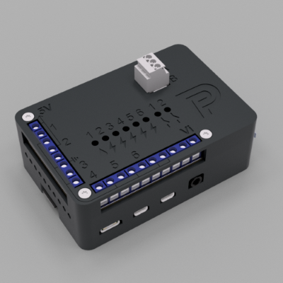

# p1hat
Rasbperry Pi P1 Monitor (ztatz.nl) IO HAT

## Aansluitingen

## Inputs

Er zijn 6 gebufferde ingangen geschikt voor open-collector apparaten.
Zoals S0 pulsen van energiemeters of NPN type inductieve sensoren voor watermeters.

Het buffer is een 74LVC07A met schmitt trigger ingangen en open drain uitgangen. 
Hiervoor is het dus nodig om de pull-ups in de BCM te activeren. 
Een ander buffer kan ook, velen passen op deze SOIC footprint.

Het filternetwerk 1k/1nF dempt eventuele ingekoppelde storingen en de sterke pull-up van 1 kOhm voorkomt spontane detecties. *(van nabij schakelende relais, motoren of andere storingen)*  

> Als er schakelaars worden aangesloten dient dit netwerk wellicht te worden vertraagd, probeer 100k en 10nf. Of [debounce](https://en.wikipedia.org/wiki/Switch#Contact_bounce) in software.

## Outputs

Twee smart high side fets kunnen bijna elke 12/45V last schakelen.
 - Ze zijn geschikt voor high-side switching. 
 - Ze zijn geschikt voor inductieve lasten zonder vrijloop diode. (relais)
 - Ze zijn thermisch kortsluitbeveiligd.
 
Vrijwel niet kapot te krijgen.

## RS-485

Op de print zit een RS-485 tranceiver. Om bijvoorbeeld te praten met RS-485 energiemeters.
De middelste pin van de RS-485 header is GND, dit is meestal niet nodig.

> Hoe dit op de raspberry werkt moet ik nog uitzoeken.  

## GPIO Header

| Board          | GPIO | Mode       |
|----------------|------|------------|
| IN1            | 17   | Pull-up    |
| IN2            | 27   | Pull-up    |
| IN3            | 22   | Pull-up    |
| IN4            | 23   | Pull-up    |
| IN5            | 24   | Pull-up    |
| IN6            | 25   | Pull-up    |
| OUT1           | 26   | Push-Pull  |
| OUT2           | 16   | Push-Pull  |
| RS485 TX       | 14   | Alt0       |
| RS485 RX       | 15   | Alt0       |
| RS485 TXENABLE | 18   | Push-Pull  |

## BOM

Lijst met onderdelen:

- PCB, zie .txt file in de map PCB voor onderdelen.
    - De onderdelen zijn te krijgen op AliExpress en Conrad.
- Raspberry Pi 4 met SD kaart en P1 Monitor
- Behuizing 3D-geprint van PETG.
- Schroeven
    - 4x M2.5x14 Verzonken Torx (TX8) WS 9475TX
    - 4x M2.5x12 Verzonken Torx (TX8) WS 9475TX
        - Zie [rvspaleis.nl](https://www.rvspaleis.nl/bouten/torx/ws-9475/ws-9475-[-]-a2-[-]-m2,5)

## Software

De gebruikte software is (gratis) Autodesk Fusion 360 voor niet-commercieel gebruik. 
De `*.f3z` bestanden zijn archieven hiervan.